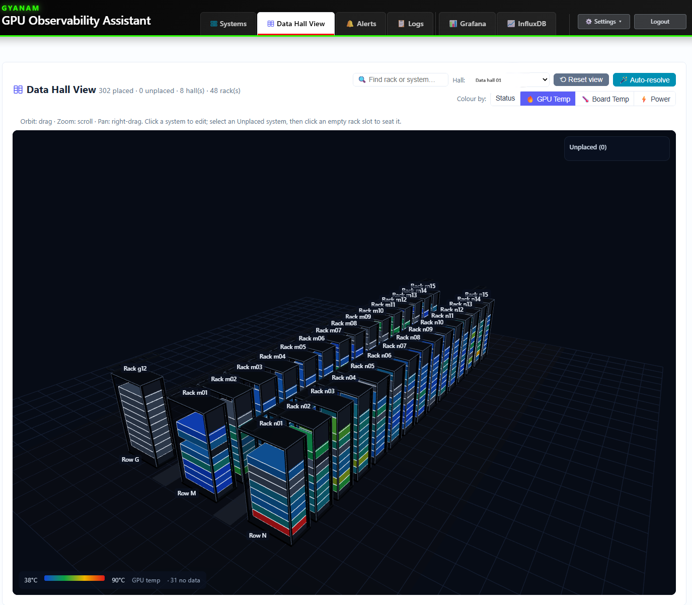
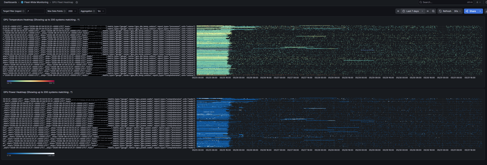
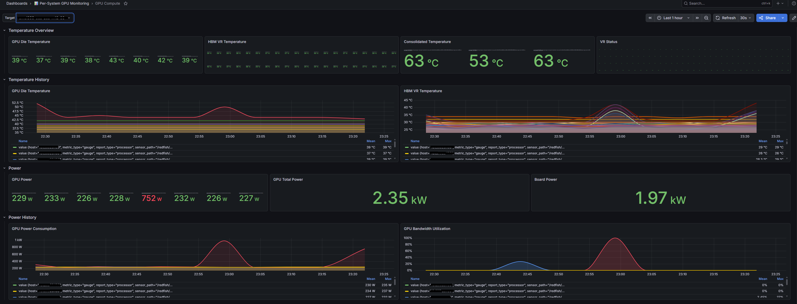
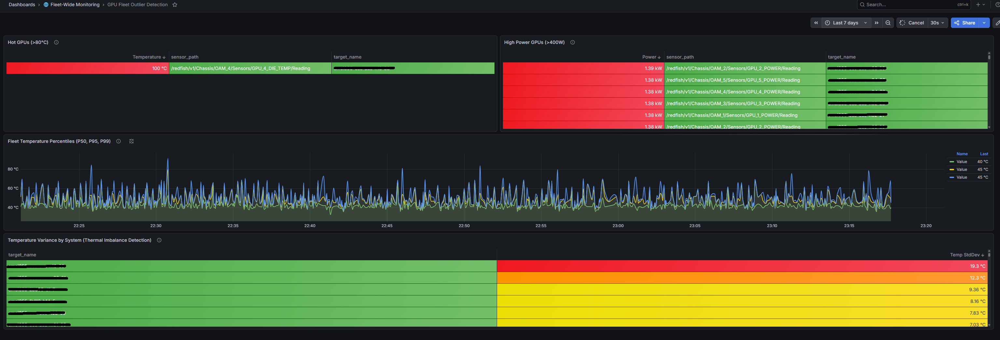
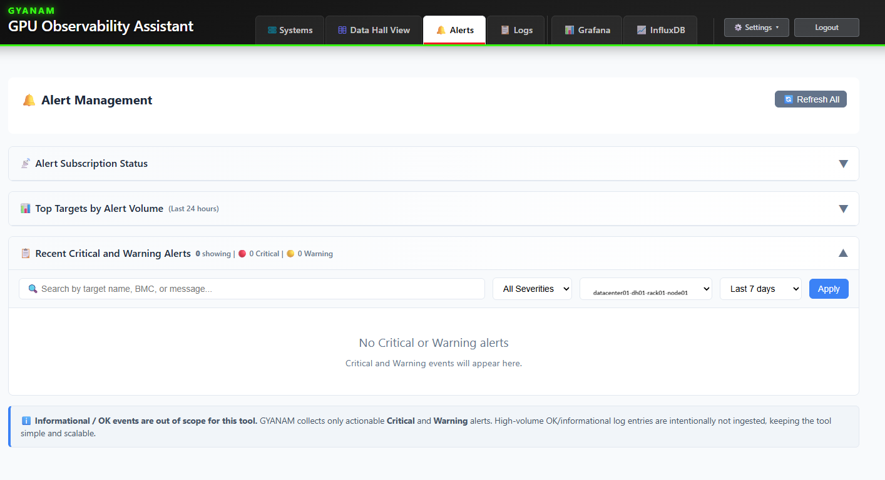
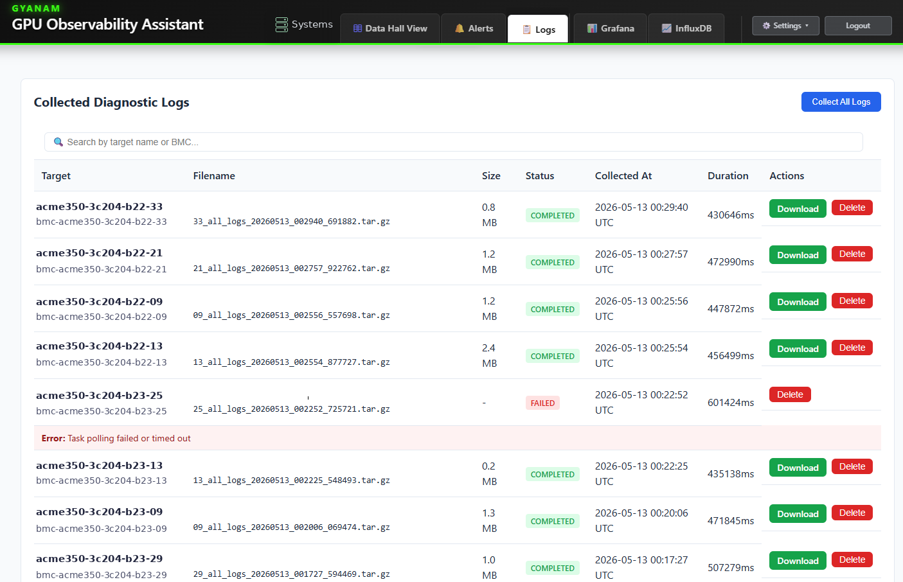
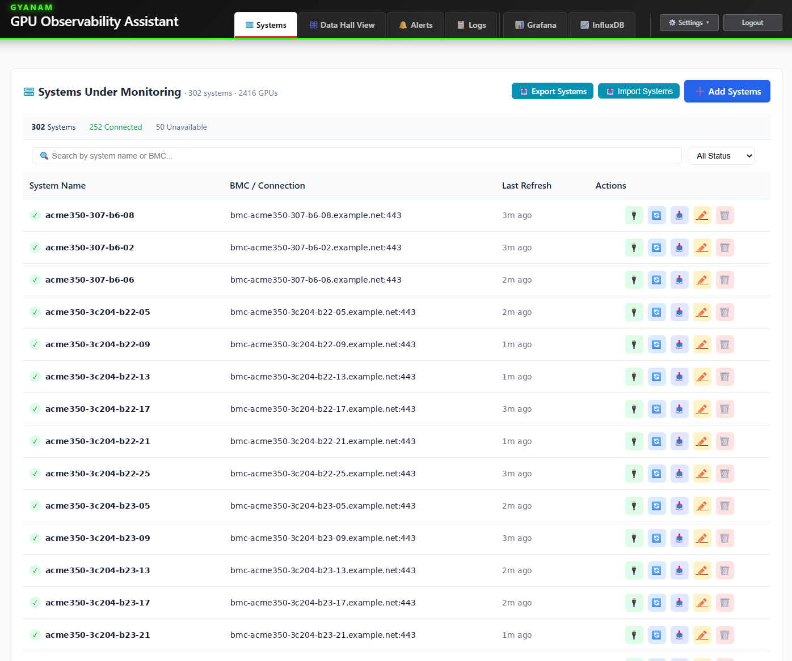

# GYANAM — GPU Observability Assistant

**Primary goal**: provide an open cluster- or fleet-wide **debug and observability reference
implementation for GPU products** — giving operators accurate,
continuous, out-of-band telemetry, intuitive **digital-twin views** of the
fleet (such as the **Data Hall view**, which renders every GPU system in its
physical hall / row / rack / U position with a live thermal and power heatmap
overlay), and shareable diagnostic evidence from GPU UBB8 / rack-based GPU
fleets, using only industry-standard interfaces and without proprietary agents
or vendor lock-in.

Those digital-twin views are more than a map. Each one renders the *current*
snapshot of the fleet — every system's live thermal, power, and health state in
its real physical position — as a faithful reflection of the hardware. Behind
that snapshot, GYANAM continuously gathers telemetry from every GPU server
through DMTF Redfish-defined interfaces — using native Redfish Aggregation or
Redfish Proxy based methods on ODM/OEM BMCs that support it — parses it into a
schema-aware metric model, and stores it as time-series history in InfluxDB. The
live snapshot and the accumulated historical telemetry together give operators
and debug engineers everything required for effective debug: see how a system
reached its current state, compare it against its neighbours, and trace an
anomaly back through time.

Put simply, GYANAM is a **digital twin for observability and debug** — a live
reflection of the fleet, backed by historical time-series telemetry and
on-demand diagnostic-log collection for evidence gathering, root-cause analysis,
and failure analysis, rounded out with alert subscriptions, pre-built Grafana
dashboards, and a CSV export pipeline. It is deliberately read-only and
out-of-band: **configuration, provisioning, and lifecycle management of the
systems themselves are entirely out of scope.**

<!-- HERO IMAGE — Data Hall digital twin with a live thermal/power heatmap overlay.
     Copy the Data Hall screenshot to docs/screenshots/01-datahall-twin.png
     (open the Data Hall view, switch "Colour by" to a heatmap mode). -->


<br/><sub><b>The Data Hall digital twin</b> — every GPU system rendered in its real hall / row / rack / U
position, coloured by a live thermal/power heatmap. This is the current snapshot; everything behind it
is backed by continuous historical telemetry.</sub>

## Problem Statement

Running rack-based GPU fleets at scale, **observability and health
monitoring** are what keep jobs productive. Operators — whether a
hyperscaler, a startup neocloud, an established software org, or an
early-stage team — need open, ready-made building blocks for
**cluster-wide and fleet-wide debug and observability**: continuous
telemetry across every node, fast detection of the outliers that signal
trouble, and the ability to package diagnostic evidence the moment a job
breaks. Without that, debug starts from a cold trail.

These same themes show up in industry references like SemiAnalysis's
[ClusterMAX™ rating system](https://www.clustermax.ai/), which evaluates
GPU clouds in part on proactive health checks, out-of-the-box dashboards,
and fleet-wide monitoring — a useful articulation of what good GPU
observability looks like in practice.

GYANAM aims to make those building blocks available and open. As a GPU
hardware company, our interest is straightforward: **faster debug and
faster turnaround, so customer productivity returns as quickly as
possible — regardless of fleet size or customer maturity.** Debug
organizations today too often receive
incomplete or stale diagnostic data from the point of failure, limiting
root-cause accuracy and slowing RMA Failure Analysis. GYANAM is an
on-premise, customer-deployable assistant that harvests time-series
telemetry and critical debug logs using only open specifications — DMTF
Redfish, OCP OAM, and related standards — so teams can autonomously
collect, inspect, and share comprehensive observability and debug data,
improving **Time to Hypothesis (TTH)** and **Time to Root Cause (TTR)**
while building trust through full transparency of the implementation.

## What GYANAM does

The GPU Observability Assistant provides:

-   **Continuous large-scale observability** — automated, periodic
    harvesting of OOB telemetry across a 5K-GPU cluster with
    per-target persistent connections, fire-and-forget scheduling, and
    tiered retention for long-term analysis.
-   **Debug-effort enablement** — on-demand diagnostic log-bundle
    collection per target, structured alert subscriptions (SSE +
    webhook fallback), and a robust CSV export pipeline with
    pre-flight count, chunking, retry, and server-side aggregation
    for sharing evidence with engineering.
-   **Standards-only data plane** — DMTF Redfish + OCP-aligned schemas,
    no proprietary agents on the host.
-   **On-premise deployment** — runs entirely inside the customer's
    security boundary; nothing leaves their network unless explicitly
    exported.
-   **Customer-initiated data packaging** — operators decide what
    snapshots to share when filing tickets or RMAs.
-   **Reference implementation for the ecosystem** — an open GPU
    observability/debug baseline that OEMs, cloud partners, and customers
    can adopt and align around open standards.

## Supported Features

What works today for cluster-wide and fleet-wide debug and observability:

| Capability | Details |
|------------|---------|
| **Out-of-band telemetry collection** | DMTF Redfish telemetry gathering (Redfish Aggregation or proxy-based) sized for a standard 5K-GPU cluster (typical of a training or inference AI cluster size). Categories available for deep-dive: temperature (GPU die, HBM memory, VR, board), power (per-GPU, aggregate, board), voltage & current (HBM, VDD, GPU-IO, VR rails), GPU utilization & memory bandwidth, link & connectivity (retimer, processor-port / interconnect), and health & status rollups — validated against GPU UBB8 reference artifacts |
| **Data Hall digital twin** | Interactive 3D rendering of the fleet laid out by hall / row / rack / U, seeded automatically from hostname and Redfish `Chassis` location. A live **thermal / power heatmap overlay** recolors every system by GPU die temp, board temp, or board power against a fixed per-component scale — surfacing hot racks and power imbalance at a glance — with per-system inventory on hover |
| **Standards-aware metric onboarding** | Auto-discovers each target's `TelemetryService/MetricReports` so whatever a conformant BMC exposes is consumed without per-vendor code; 33 embedded JSONPath metric schemas remain the fallback + test fixtures |
| **Alternative transports** | SSE streaming where the BMC supports it; webhook fallback for alert delivery |
| **Schema-aware extraction** | JSONPath metric schemas + auto-discovery of numeric fields |
| **GPU health metrics** | Temperature, power, clock, ECC/memory errors, and other OOB sensor data |
| **Time-series storage** | InfluxDB 2.7, with 15-min / hourly downsampling and tiered retention |
| **Pre-built Grafana dashboards** | 11 dashboards — fleet-wide, per-system drill-down, and historical trend views |
| **Fleet outlier detection** | Dashboard surfacing hot GPUs, high-power consumers, and thermal imbalance across the fleet |
| **Alerting** | Real-time SSE / webhook alert subscriptions with severity routing and history |
| **On-demand diagnostic logs** | Per-target log-bundle collection, download, and sharing for debug / RMA |
| **Debug-evidence export** | CSV export pipeline with pre-flight count, chunking, retry, and server-side aggregation |
| **Redfish interop profile** | A DMTF [DSP0272](https://www.dmtf.org/dsp/DSP0272) profile ([`profiles/`](profiles/)) declaring the **minimal set of Redfish APIs a system must support to onboard into GYANAM** — vendors can self-test conformance with the DMTF Redfish-Interop-Validator |
| **Security posture** | SSRF/CSRF protection, bcrypt auth, Fernet-encrypted credentials, path-traversal protection, CodeQL-scanned (see [`docs/CODEQL_REPORT.md`](docs/CODEQL_REPORT.md)) |

Have a use case or want to help? See [Contributing](#contributing).

## Quick Start

All operations use the `gyanam.sh` management script. This is the
short path; the full guide is in [`docs/DEPLOYMENT.md`](docs/DEPLOYMENT.md).

```bash
./gyanam.sh init     # one-time: generates .env (save the printed credentials)
./gyanam.sh start    # boots all five containers
```

| Service | URL | Default Credentials |
|---------|-----|---------------------|
| Web UI | http://localhost:8080 | admin / changeme |
| Grafana | http://localhost:3000 | (from init output) |
| InfluxDB | http://localhost:8086 | (from init output) |

Then open the Web UI, click **Add Target**, enter BMC connection details,
and click **Test** to verify. For bulk onboarding use **Import CSV** /
**Export CSV** on the targets page. Full management commands, downsampling
setup, and export recipes are documented in the
[guides below](#documentation).

## Screenshots

The gallery follows the same arc as the tool itself: start from the **live snapshot**, drop into
the **historical time-series** that explains it, let the history **surface the outliers**, and finish
with the **evidence** you collect and share to close out a root-cause.

<!-- Gallery — capture per docs/screenshots/README.md -->

<a href="docs/screenshots/02-fleet-heatmap.png">
  
</a>
<br/><sub><b>Fleet Heatmap</b> — temperature and power across every GPU in the fleet. A Grafana view backed
by the full time-series history, so you can scrub back and watch the fleet heat up or cool down over any window.</sub>

<br/><br/>

<a href="docs/screenshots/04-gpu-compute.png">
  
</a>
<br/><sub><b>Per-system drill-down</b> — every GPU's compute, memory, interconnect, and power as historical
time-series, not just a live reading. This is where you see <em>how</em> a system reached its current state
and compare it against its neighbours.</sub>

<br/><br/>

<a href="docs/screenshots/07-fleet-outliers.png">
  
</a>
<br/><sub><b>Outlier detection</b> — hot GPUs, high-power consumers, thermal imbalance. Derived from the
telemetry history so a transient spike and a sustained trend read differently — anomalies surface fast.</sub>

<br/><br/>

<a href="docs/screenshots/05-alerts-page.png">
  
</a>
<br/><sub><b>Alerts</b> — real-time SSE / webhook subscriptions with severity routing, plus the full alert
history alongside the telemetry that triggered it.</sub>

<br/><br/>

<a href="docs/screenshots/06-collected-logs.png">
  
</a>
<br/><sub><b>Diagnostic log bundles</b> — the evidence layer: on-demand harvest, download, and share for
RMA or debug tickets, pairing the time-series record with logs from the moment of failure for root-cause.</sub>

<br/><br/>

<a href="docs/screenshots/03-targets-page.png">
  
</a>
<br/><sub><b>Targets</b> — what the twin is built from: bulk CSV import, per-target test &amp; on-demand log
collection, and live telemetry-gathering status for every node.</sub>

> Screenshots above expect PNG files under [`docs/screenshots/`](docs/screenshots/)

## Contributing

GYANAM is open source and welcomes contributions from everyone —
hyperscaler operator, neocloud engineer, or individual debugging a single
node. Bug reports, dashboard additions, new metric schemas, transport
support, and documentation are all valued.

**Reporting issues** — bugs, feature requests, and questions go through the
standard GitHub issue process at
[github.com/amd/Gyanam-GPU-Observability-Assistant/issues](https://github.com/amd/Gyanam-GPU-Observability-Assistant/issues).
Click *New Issue* to use the bug-report or feature-request template. Please
search existing issues first, and **do not** file security vulnerabilities
as public issues — follow [SECURITY.md](SECURITY.md) instead.

Please read **[CONTRIBUTING.md](CONTRIBUTING.md)** before opening a pull
request. In short:

- All commits require a **DCO sign-off** (`git commit -s`).
- Run the linters / hooks documented in [`LINTING.md`](LINTING.md).
- Follow the commit-message convention in the contributing guide.

## License

GYANAM is licensed under the **MIT License** — see [LICENSE](LICENSE).
Copyright © 2026 Advanced Micro Devices, Inc.

## Documentation

| Doc | When to read it |
|-----|-----------------|
| [`docs/DEPLOYMENT.md`](docs/DEPLOYMENT.md) | Full setup / deployment on Ubuntu, sized for a 5K-GPU cluster |
| [System Architecture (PDF)](docs/architecture.pdf) | Runtime data flow + 5-container layout (source: [`docs/architecture.mmd`](docs/architecture.mmd)) |
| [Class Diagram (PDF)](docs/class-diagram.pdf) | Class relationships across layers (source: [`docs/class-diagram.mmd`](docs/class-diagram.mmd)) |
| [`docs/SCALABILITY.md`](docs/SCALABILITY.md) | Tuning per fleet size + understanding the runtime architecture |
| [`docs/DATA_EXPORT_REFERENCE.md`](docs/DATA_EXPORT_REFERENCE.md) | Exporting metrics to CSV (gyanam.sh wrapper + native InfluxDB recipes) |
| [`profiles/README.md`](profiles/README.md) | Redfish interop profile — the minimal Redfish APIs a system must expose to onboard, and how to validate a BMC against it |
| [`scripts/README.md`](scripts/README.md) | Volume / disk-space monitoring scripts and automated growth tracking |
| [`LINTING.md`](LINTING.md) | Pre-commit / ruff / mypy / shellcheck setup |
| [`CONTRIBUTING.md`](CONTRIBUTING.md) | How to contribute, DCO sign-off, PR workflow |

For the full set of management commands (`stop`, `restart`, `status`,
`monitor`, `logs`, `build`, downsampling setup, InfluxDB export, `clean`),
run `./gyanam.sh help`.
